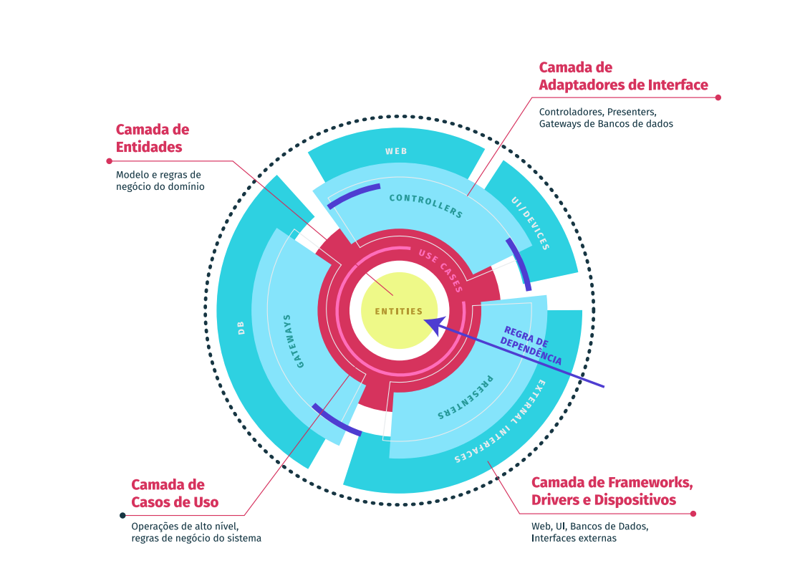

# Considerações Iniciais ⚠️
A aplicação Easy Farm ainda não foi completamente estabilizada, pois o foco principal do desenvolvimento foi centrado no domínio. Foi realizada a implantação na AWS utilizando ECS (Elastic Container Service) e ALB (Application Load Balancer). Embora a aplicação esteja funcionando, ela ainda necessita de algumas atualizações que serão realizadas em um momento oportuno.

# Easy Farm - Cadastro de Produtores Rurais

## Descrição

Easy Farm é uma aplicação desenvolvida seguindo os princípios de Clean Architecture. A aplicação permite o cadastro de produtores rurais com informações detalhadas sobre suas fazendas e culturas plantadas.

## [Documentação dos endpoints](./rest.md)

## Estrutura do Projeto

A estrutura do projeto é organizada em camadas, conforme a Clean Architecture:




```
src/
├── application/
│   └── usecases/
│       └── farmer/
├── domain/
│   ├── common/
│   ├── entities/
│   └── gateway/
├── infra/
│   ├── adapters/
│   ├── database/
│   └── http/
├── app.module.ts
└── main.ts

```

## Funcionalidades

- Cadastro de produtor rural
- Registro das seguintes informações:
  - CPF ou CNPJ
  - Nome do produtor
  - Nome da fazenda
  - Cidade
  - Estado
  - Área total em hectares
  - Área agricultável em hectares
  - Área de vegetação em hectares
  - Culturas plantadas (Soja, Milho, Algodão, Café, Cana de Açúcar)


